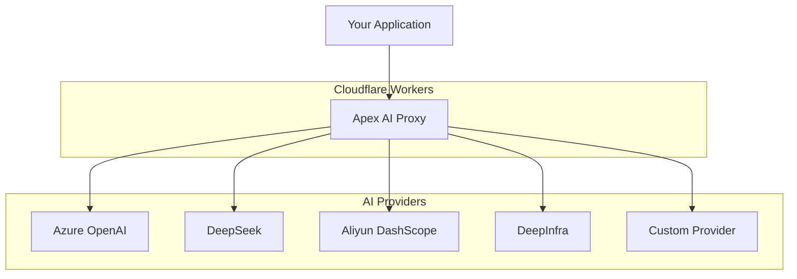

# Guide

Welcome to the comprehensive Apex AI Proxy guide! This documentation will help you master all aspects of deploying, configuring, and using your personal AI gateway.

## Overview

Apex AI Proxy is a powerful solution that aggregates multiple AI service providers behind a unified OpenAI-compatible API. It runs on Cloudflare Workers and helps you overcome rate limits, maximize free quotas, and simplify your AI integrations.

## Getting Started

### New to Apex AI Proxy?

If you're just getting started, we recommend following this learning path:

1. **[Quick Start](/quick-start)** - Get up and running in 60 seconds
2. **[Installation](./installation)** - Detailed installation instructions
3. **[Configuration](./configuration)** - Learn how to configure providers and models
4. **[Basic Usage](./quick-start)** - Make your first API calls

### Core Concepts

Understanding these concepts will help you get the most out of Apex AI Proxy:

#### 🔄 Provider Aggregation
Apex AI Proxy acts as a smart router that distributes requests across multiple AI providers. This allows you to:
- Overcome individual provider rate limits
- Take advantage of multiple free tiers
- Ensure high availability through automatic failover

#### 🔑 Unified Authentication
Instead of managing multiple API keys in your applications, you configure them once in the proxy and use a single service key for all requests.

#### 🤖 OpenAI Compatibility
All interactions use the familiar OpenAI API format, making integration seamless with existing codebases and tools.

## Architecture



## Key Features

### 🆓 Completely Free
- Runs on Cloudflare Workers' free tier
- No server maintenance required
- No hidden costs or subscriptions

### 🔄 Smart Load Balancing
- Automatic request distribution
- Failover on provider errors
- Round-robin and weighted strategies

### 💰 Cost Optimization
- Maximize free quotas across providers
- Intelligent provider selection
- Usage tracking and optimization

### 🛡️ Robust Error Handling
- Graceful failover between providers
- Comprehensive error mapping
- Retry logic with exponential backoff

### 🌐 Multi-Protocol Support
- OpenAI Chat Completions API
- OpenAI Embeddings API
- Anthropic Messages API
- Next-gen `/v1/responses` API

## Quick Reference

### Essential Commands

```bash
# Install dependencies
pnpm install

# Start development server
pnpm run dev

# Deploy to production
pnpm run deploy

# View logs
wrangler tail
```

### Basic Configuration

```javascript
// wrangler-config.js
const providerConfig = {
  azure: {
    base_url: 'https://your-resource.openai.azure.com/openai/deployments/your-deployment',
    api_keys: ['your-azure-key'],
  },
  deepseek: {
    base_url: 'https://api.deepseek.com/v1',
    api_keys: ['your-deepseek-key'],
  },
};

const modelProviderConfig = {
  'gpt-4o-mini': {
    providers: [
      { provider: 'azure', model: 'gpt-4o-mini' },
      { provider: 'deepseek', model: 'deepseek-chat' },
    ],
  },
};
```

### Basic Usage

```python
from openai import OpenAI

client = OpenAI(
    base_url="https://your-proxy.workers.dev/v1",
    api_key="your-service-api-key"
)

response = client.chat.completions.create(
    model="gpt-4o-mini",
    messages=[{"role": "user", "content": "Hello!"}]
)
```

## Documentation Sections

### 📚 Getting Started
Perfect for newcomers to understand the basics and get their first deployment running.

- [Installation](./installation) - Step-by-step setup instructions
- [Configuration](./configuration) - Provider and model configuration
- [Quick Start](./quick-start) - 60-second deployment guide

### 🚀 Advanced Usage
Deep dive into advanced features and optimization techniques.

- [Multiple API Keys](./multiple-keys) - Scale beyond rate limits
- [Load Balancing](./load-balancing) - Optimize request distribution
- [Error Handling](./error-handling) - Robust error management
- [Monitoring](./monitoring) - Track usage and performance

### 🔌 Integrations
Learn how to integrate with popular tools and frameworks.

- [OpenAI SDK](./integrations/openai) - Drop-in replacement setup
- [Anthropic SDK](./integrations/anthropic) - Claude integration
- [Claude Code](./integrations/claude-code) - Development tool integration
- [Langchain](./integrations/langchain) - Framework integration

### 📊 API Reference
Complete API documentation with examples and best practices.

- [Chat Completions](/api/chat-completions) - Text generation API
- [Embeddings](/api/embeddings) - Vector embeddings API
- [Models](/api/models) - Available models endpoint
- [Responses API](/api/responses) - Next-gen response API

### 🔑 Provider Guides
Detailed setup instructions for each supported provider.

- [Azure OpenAI](/providers/azure) - Enterprise OpenAI service
- [DeepSeek](/providers/deepseek) - High-performance models
- [Aliyun DashScope](/providers/aliyun) - Alibaba Cloud AI
- [DeepInfra](/providers/deepinfra) - Open-source model inference

## Best Practices

### 🎯 Configuration
- Use multiple providers for the same model to ensure redundancy
- Configure multiple API keys per provider to scale beyond rate limits
- Set up proper fallback chains for critical applications

### 🔐 Security
- Keep your configuration files secure and out of version control
- Use environment variables for sensitive data in production
- Regularly rotate your API keys

### 📈 Performance
- Monitor your usage patterns to optimize provider selection
- Use appropriate models for different use cases
- Implement proper caching strategies in your applications

### 💰 Cost Management
- Take advantage of free tiers from multiple providers
- Monitor usage to avoid unexpected charges
- Use cheaper models for development and testing

## Community & Support

### 🤝 Getting Help
- **Documentation**: You're reading it! Search for specific topics
- **GitHub Issues**: Report bugs and request features
- **Discussions**: Ask questions and share ideas with the community

### 🌟 Contributing
We welcome contributions! Check out our:
- [GitHub Repository](https://github.com/loadchange/apex-ai-proxy)
- [Contribution Guidelines](https://github.com/loadchange/apex-ai-proxy/blob/main/CONTRIBUTING.md)
- [Code of Conduct](https://github.com/loadchange/apex-ai-proxy/blob/main/CODE_OF_CONDUCT.md)

---

## Next Steps

Choose your path based on your experience level:

### 🆕 New Users
1. Complete the [Quick Start](/quick-start) tutorial
2. Read about [Configuration](./configuration)
3. Explore [Provider Setup](/providers/)

### 🔧 Developers
1. Review the [API Reference](/api/)
2. Check out [Integration Guides](./integrations/openai)
3. Learn about [Advanced Usage](./multiple-keys)

### 🏢 Enterprise Users
1. Understand [Security Best Practices](./configuration#security)
2. Set up [Monitoring and Analytics](./monitoring)
3. Plan your [Multi-Provider Strategy](./load-balancing)

Ready to dive in? Start with our [Quick Start guide](/quick-start) and have your proxy running in under 60 seconds!
